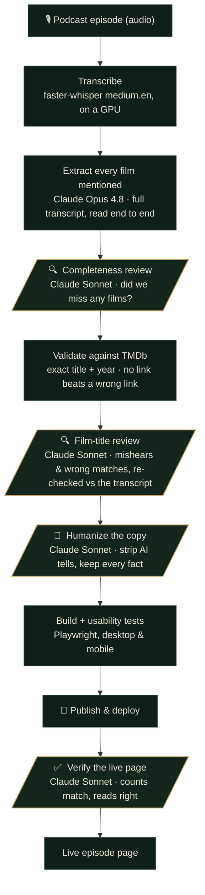

# The Full Picture

**Every film named on The Ringer's *The Big Picture*, tied to what the hosts actually said and
checked against a film database before it's published. One page per episode.**

This repository is public for one reason: **transparency about how these pages are made.** The site
uses AI models for transcription, for extracting the films from each episode, for reviewing those picks,
and for writing the copy. This document lists which models do what, what gets checked, and what data
goes where.

A single episode can name dozens of movies. Some get a full review, some get fought over in a draft,
and most are just mentioned in passing between tangents. The Full Picture turns each one into a linked,
fact-checked record of what was said about it, across the show's entire back catalogue.

## How an episode becomes a page



The gold steps are review gates. A draft doesn't become a page until it clears every one, and the
verification step re-checks the page *after* it's live.

## Every AI model we use, and what it does

Each step below names the model and the job it does:

| Step | Model | What it does |
| --- | --- | --- |
| **Transcription** | `faster-whisper medium.en` (open-source Whisper) | Turns the episode audio into a timestamped transcript. This is the *only* model that touches the audio. Runs on a GPU for new episodes (and ran locally on CPU for the back catalogue). |
| **Extraction** | **Claude Opus 4.8** | Reads the *entire* transcript, never a summary, and models the episode as its on-air segments (a review, a draft, a ranking, a mailbag), pulling out every film with its year and a short note on what was said. |
| **Completeness review** | **Claude Sonnet** | Re-reads the transcript looking for films that were discussed but *missed* by extraction. Conservative by design: it flags clear omissions but doesn't invent a film. |
| **Film-title review** | **Claude Sonnet** | Checks every pick against the transcript and the TMDb credits, catching transcription mishears (Nirvana → Nirvanna) and same-title collisions the automatic match gets wrong. |
| **Copy review** | **Claude Sonnet** | Rewrites the episode blurb and film notes to read like a person wrote them, while preserving every fact, quote, title, year, and number. |
| **Post-publish verification** | **Claude Sonnet** | After the page is live, re-reads the published record for anything that would embarrass us on a public page. Raises a flag for a human; never edits silently. |

The models don't have the last word: extraction is a *draft*, and everything after it is verification.
Deterministic checks sit between the model steps too: exact TMDb title+year matching, film/segment
counts on the rendered page, and a Playwright usability suite.

## The checks every episode passes

| Gate | What it guarantees |
| --- | --- |
| **Full-transcript extraction** | The whole transcript is read start to finish, never handed to a small summarizer. Each film is tied to what the hosts said about it: director, cast, premise. |
| **🔍 Completeness review** | A dedicated second pass looks specifically for films that were named but dropped from the first draft. |
| **TMDb validation** | Exact title plus release-year matching. A same-title coincidence or a wrong-year reboot is rejected; a missing link is better than a wrong one. |
| **🔍 Film-title review** | Every pick is re-checked against the transcript and the TMDb credits before anything publishes. |
| **🎨 Copy review** | Blurbs and notes are made human-readable without changing a single fact. |
| **✅ Live-page verification** | Once deployed, the live page's film and segment counts are checked against the record, and the content is re-read for errors. |

> **A real catch from review.** A Diane Keaton episode listed *Sleeper*. The automatic match linked a
> 2012 film with no Keaton in it; the review checked the transcript, found the hosts meant the 1973
> Woody Allen movie, and repinned it. *The Good Mother* had the same issue: a 2023 film matched
> instead of her 1988 one. Both were fixed before the page went live. That kind of mismatch is common
> enough that it's the whole reason the review gates exist.

## The honesty rules

- **Never guess an attribution.** If it isn't clear from the audio who drafted what, the credit comes
  from the hosts' own end-of-episode recap, or the page ships with a plain note about the ambiguity.
  Nothing is fabricated.
- **Show the misses.** A film too new or too obscure to match stays unlinked rather than mislinked.
  Non-films (TV, games, ad reads) are filtered out and listed, so you can see what was filtered.
- **Label the AI.** Every episode page says plainly that it was transcribed and analyzed with AI
  models, and that the occasional misheard title or wrong link is expected.
- **Cite the source.** Every film links to its TMDb entry, and every page links back to the episode on
  Spotify.

## What leaves the box

Very little, and we're specific about it:

- The episode **audio** is sent to the transcription GPU (a rented, ephemeral serverless worker; the
  code is at `kdorepos/tfp-runpod-worker`) purely to produce the transcript. It isn't stored or reused.
- **TMDb** is queried for film metadata (title, year, poster) and **Spotify** for the episode's
  playback link. That's the only outbound traffic in normal operation.
- The **audio and raw transcripts are not published**; only the derived, reviewed film lists are.

## Under the hood

```
pipeline/   Python: transcription client + TMDb/Spotify enrichment + the publish/verify orchestration
web/        Astro static site: one page per episode, rendered from the reviewed JSON
.claude/    the review agents (completeness, film-title, copy, verification) as versioned prompts
```

The per-episode JSON is the hand-off between the two halves, and it's what every review gate signs
off on. The full pipeline is documented in `CLAUDE.md`; the review agents in `.claude/agents/`; the
visual identity in `web/DESIGN.md`.

---

<sub>This product uses the TMDB API but is not endorsed or certified by TMDB. Podcast metadata and
playback via Spotify. A fan-made record, independent and unaffiliated with The Ringer.</sub>
