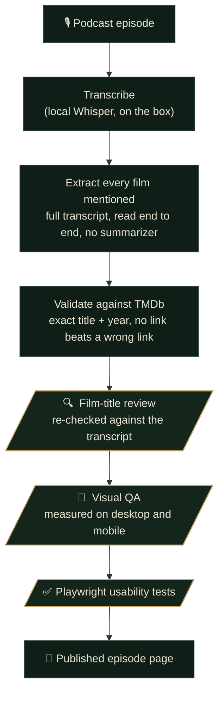

# The Full Picture

**Every film named on the podcast, tied to what the hosts actually said and checked against a film database before it's published. One page per episode.**

Built and tested against The Ringer's *The Big Picture*. A single episode can name dozens of movies: some reviewed in depth, some picked apart in a draft, most just mentioned between tangents. The Full Picture turns each one into a linked, fact-checked record of what was said about it.

A local model handles the volume: transcription and a first-pass draft. Everything after that is verification. Each film is checked against the transcript and against a film database before its page goes live, so the record reflects what was said rather than what a model guessed.

## How an episode becomes a page



The gold steps are review gates. A draft doesn't become a page until it clears all three.

## The checks every episode passes

| Gate | What it guarantees |
| --- | --- |
| **Full-transcript extraction** | The whole transcript is read start to finish, never handed to a small summarizer. Each film is tied to what the hosts actually said about it: director, cast, premise. |
| **TMDb validation** | Exact title plus release-year matching. A same-title coincidence or a wrong-year reboot gets rejected; a missing link is better than a wrong one. |
| **🔍 Film-title review** | A dedicated reviewer re-checks every pick against the transcript and the TMDb credits, catching transcription mishears and same-title collisions the automatic match misses. Runs before anything publishes. |
| **🎨 Visual QA** | The tests measure the layout: element collisions, text overflow, tap-target sizes, and horizontal scroll, on desktop and mobile. |
| **✅ Usability tests** | A Playwright suite runs on every build, on both viewports. |

> **A real catch from review.** A Diane Keaton episode listed *Sleeper*. The automatic match linked a 2012 film with no Keaton in it; the review checked the transcript, found the hosts meant the 1973 Woody Allen movie, and repinned it. *The Good Mother* had the same issue: a 2023 film matched instead of her 1988 one. Both were fixed before the page went live, and that kind of error shows up regularly.

## The honesty rules

- **Never guess an attribution.** If it isn't clear from the audio who drafted what, the credit comes from the hosts' own end-of-episode recap, or the page ships with a plain note about the ambiguity. Nothing is fabricated.
- **Show the misses.** A film too new or too obscure to match stays unlinked rather than mislinked. Non-films (TV, games, ad reads) are filtered out and listed, so you can see what got filtered.
- **Cite the source.** Every film links to its TMDb entry, and every page links back to the episode on Spotify.

## Under the hood

```
pipeline/   Python CLI: podcast URL to local transcript (faster-whisper on CPU)
web/        Astro static site: one page per episode, rendered from the verified JSON
```

Transcription runs entirely on the box, with no network and no rate limits; only TMDb and Spotify are queried, for metadata. The per-episode JSON is the hand-off between the two halves, and it's what every review gate signs off on.

<details>
<summary><b>Running it</b></summary>

```sh
# transcribe locally with faster-whisper (needs TMDB_KEY in a gitignored .env for enrichment)
python3 -m venv venv && ./venv/bin/pip install faster-whisper
./venv/bin/python pipeline/the_full_picture.py <rss-feed-or-episode-url>
#   larger model, fewer misheard titles, slower: --model large-v3-turbo

# the site
cd web && npm install
npm run dev        # http://localhost:4321
npm run build      # -> dist/ (static)
npm test           # Playwright, desktop + mobile
```

Extraction, TMDb validation, and the review gates run through a Claude session against the transcript. The full pipeline and the engine trade-offs are documented in `CLAUDE.md`, the review agents in `.claude/agents/`, and the visual identity in `web/DESIGN.md`.

Deploy by importing the repo on Vercel with Root Directory set to `web`. Every push redeploys.
</details>

---

<sub>This product uses the TMDB API but is not endorsed or certified by TMDB. Podcast metadata and playback via Spotify. A fan-made record, independent and unaffiliated with The Ringer.</sub>
