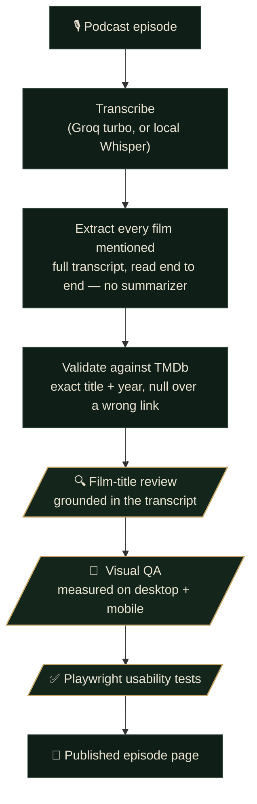

# The Full Picture

**Every film named on a podcast — catalogued, grounded in the transcript, and verified against a film database before it's published. One page per episode.**

Proven against The Ringer's *The Big Picture*. A 2½-hour episode names dozens of movies in passing — reviewed, drafted, auctioned, or just riffed on between tangents. The Full Picture turns each one into a clean, linked, fact-checked record of what was actually said.

A model does the volume — transcription and a first-pass draft. Then **every claim is grounded in what was actually said and checked against a canonical source before anything ships.** That gap — between *"a model generated it"* and *"it's been verified"* — is the entire point of the project.

## How an episode becomes a page



The gold steps are **review gates** — a draft doesn't become a page until it clears all three.

## The checks every episode passes

| Gate | What it guarantees |
| --- | --- |
| **Grounded extraction** | The full transcript is read start to finish — never handed to a small summarizer model. Every film is tied to what the hosts actually said about it: director, cast, premise. |
| **TMDb validation** | Exact-title + release-year matching. A coincidental same-title film or a wrong-year reboot is rejected — the system prefers **no link** over a **wrong** one. |
| **🔍 Film-title review** | A dedicated reviewer re-checks every pick against the transcript *and* TMDb credits — catching transcription mishears and same-title collisions the automatic match can't. **Required before publishing.** |
| **🎨 Visual QA** | Layout is *measured*, not eyeballed — element collisions, text overflow, tap-target sizes, horizontal scroll, across desktop and mobile. |
| **✅ Usability tests** | A Playwright suite runs on every build, on both viewports. |

> **Caught in review — a real example.** A Diane Keaton episode listed *Sleeper*. The automatic match linked a 2012 film with no Keaton in it. The review checked it against the transcript — the hosts meant the 1973 Woody Allen picture — and repinned the correct one. *The Good Mother* had the same problem (a 2023 film vs. her 1988 one). Both fixed before the page went live. Multiply that by every episode.

## The honesty rules

- **Never guess an attribution.** If who-drafted-what isn't clear from the audio, it's reconstructed from the hosts' own end-of-episode recap — or shipped with a plain note about the ambiguity, never fabricated.
- **Show the misses.** A film too new or too obscure to match stays unlinked rather than mislinked. Non-films — TV, games, ad reads — are filtered out *and listed*, so the filtering is visible.
- **Cite the source.** Every film links to its TMDb entry; every page links back to the episode on Spotify.

## Under the hood

```
pipeline/   Python CLI — podcast URL → local transcript (Groq turbo or faster-whisper, CPU)
web/        Astro static site — one page per episode, rendered from the verified JSON
```

Transcription is the only step that can leave the box, and only for the chosen engine; TMDb and Spotify are queried for metadata. The per-episode JSON is the hand-off between the two halves — and the thing every review gate signs off on.

<details>
<summary><b>Running it</b> — the short version</summary>

```sh
# transcribe (Groq default; needs GROQ_KEY + TMDB_KEY in a gitignored .env)
./venv/bin/python pipeline/the_full_picture.py <rss-feed-or-episode-url>
#   ...or fully local, no network, no rate limit:
python3 -m venv venv && ./venv/bin/pip install faster-whisper
./venv/bin/python pipeline/the_full_picture.py <url> --engine local

# the site
cd web && npm install
npm run dev        # http://localhost:4321
npm run build      # -> dist/ (static)
npm test           # Playwright, desktop + mobile
```

Extraction, TMDb validation, and the review gates are driven by a Claude session against the
transcript. The full pipeline, engine trade-offs, and hard-won lessons live in **`CLAUDE.md`**;
the review agents in **`.claude/agents/`**; the locked visual identity in **`web/DESIGN.md`**.

Deploy: import the repo on Vercel with **Root Directory = `web`**. Every push redeploys.
</details>

---

<sub>This product uses the TMDB API but is not endorsed or certified by TMDB. Podcast metadata and playback via Spotify. A fan-made record — independent and unaffiliated with The Ringer.</sub>
